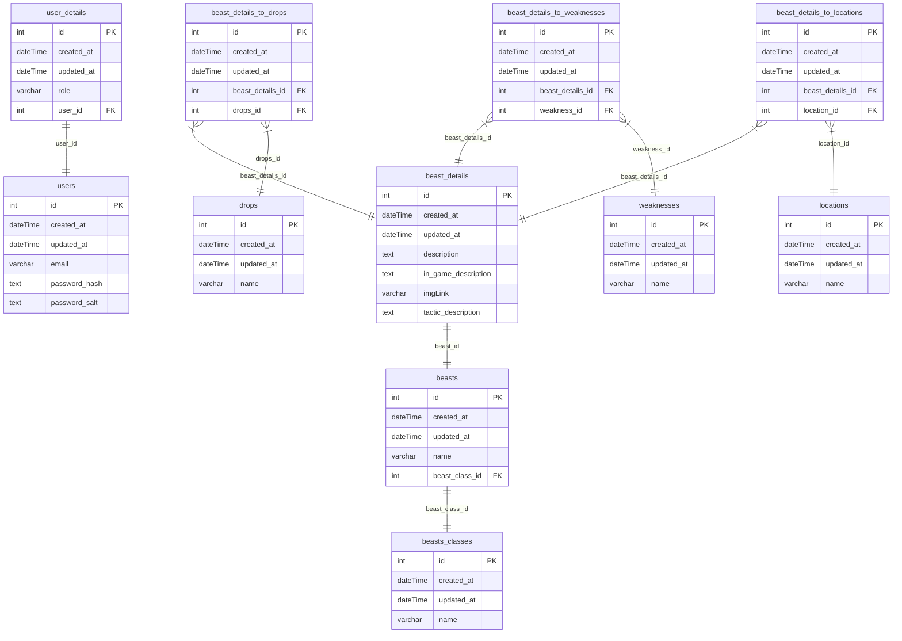

### 📕 DB Schema



#### 🗽 Pull Request flow

```
<project-prefix>-<ticket-number>: <ticket-title>
```

##### Example:

`socialNetwork-1: Add user component`

#### 🌿 Branch flow

```
<type>/<project-prefix><ticket-number>-<short-desc>
```

##### Types:

- task
- fix

##### Examples:

- `task/profile13-add-profile-page`
- `task/profile15-add-avatar-display`
- `fix/profile16-fix-avatar-size`

#### 🍕 Commit flow

```
<project-prefix>-<ticket-number>: <modifier> <desc>
```

##### 🏽 Modifiers:

- `+` (add)
- `*` (edit)
- `-` (remove)

##### Examples:

- `network-10: + table component`
- `mobile-14: * signin form input`
- `desktop-19: - redundant picture stretch`